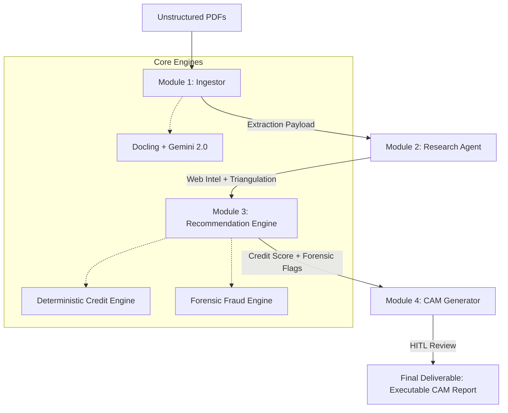

#  CertifAI (Intelli-Credit)
### *A Backend-Driven Credit Governance & Execution Engine*

> *Transforming raw financial documents into structured, accountable corporate credit operations.*

[](https://streamlit.io)
[](https://python.org)
[](https://deepmind.google/technologies/gemini/)
[](LICENSE)

---

## Overview
Financial institutions do not lack financial data — they lack **structured credit execution**. 

**CertifAI** is a role-based, multi-module pipeline designed to manage the entire corporate underwriting lifecycle: from messy PDF ingestion to a verified, forensic-ready Credit Appraisal Memo (CAM). This is not just a reporting tool; it is an **execution engine** that enforces financial policy, detects revenue anomalies via triangulation, and calculates risk using deterministic math.

---

##  Problem Statement
Corporate underwriting faces critical operational gaps:
- **Data Toil**: Manually entering numbers from 100-page audit reports.
- **Opacity**: Research reports that don't "talk" to the financial extraction.
- **Fraud Blindspots**: GST filings, Bank statements, and P&L data often exist in silos, hiding circular trading risks.
- **Inconsistency**: Subjective credit decisions lacking a deterministic math baseline.
- **SLA Pressure**: The "Turnaround Time" (TAT) for a CAM can take 5-10 days, causing deal leakage.

---

##  Solution
CertifAI introduces a **Governed Credit Lifecycle**:
- **Deep Intelligence Parsing**: Docling-powered extraction of scanned PDFs.
- **OSINT Research Triangulation**: Automated web-scraping to verify promoter background and sector risks.
- **Quantitative Risk Guardrails**: Pure-math engine for PD/LGD and Max Loan Sizing.
- **Forensic Forensic Dashboard**: Fraud engine that "red-flags" revenue vs. GST variance.
- **Human-in-the-Loop (HITL)**: A multi-agent CAM generator with manual override controls to ensure accountability.

---

##  User Roles & Responsibilities

###  Ingestion Officer (Module 1)
- Onboard entities and upload raw financials.
- Review AI document classification.
- Verify extracted financial schemas (Docling/Gemini).

###  Risk Analyst (Module 2)
- Trigger OSINT research agents.
- Monitor triangulation flags (Conflicts between web data and documents).
- Finalize the "Quality of Earnings" report.

### Credit Manager (Module 3)
- Execute the Quantitative Risk Engine (Z-Score, PD, Interest Pricing).
- Analyze the Forensic Fraud Dashboard for anomalies.
- Set collateral haircuts and loan constraints.

###  Approval Authority (Module 4)
- Review the Multi-Agent generated Credit Appraisal Memo (CAM).
- Edit and override AI-generated sections.
- Sign off and export reports (PDF/Word).

---

## System Architecture



---

##  Core Engines & Logic

### 1. Quantitative Risk Engine (`utils/credit_engine.py`)
- **Altman Z-Score**: Deterministic calculation of financial distress.
- **Probability of Default (PD)**: Rule-based adjustment considering D/E ratio, DSCR, CIBIL scores, and e-Court litigation.
- **Maximum Loan Sizing**: Constrained by DSCR (1.25x), EBITDA Multiple (3.5x), and LTV thresholds.

### 2. Forensic Fraud Engine (`utils/fraud_engine.py`)
- **Revenue Inflation Risk**: Flagged if Bank Inflows < 50% of Declared Revenue.
- **Circular Trading Risk**: Flagged if GST Sales > 1.3x Declared P&L Revenue.
- **Compliance Gap**: Detection of MCA filing delays (>365 days).

---

##  Deployment & Setup

### 1. Environment Variables
Create a `.env` file:
```env
GEMINI_API_KEY="your_google_api_key_here"
DATABRICKS_ENABLED="false" # Set true for enterprise mode
```

### 2. Quick Start
```bash
git clone https://github.com/shreya21p/certifai.git
cd certifai
pip install -r requirements.txt
streamlit run app.py
```

---

## Tech Stack
- **Backend Infrastructure**: Python, Streamlit Multi-page.
- **Intelligence Layer**: Google Gemini 2.0 Flash, IBM Docling.
- **Visualization**: Plotly, Streamlit Agraph (Entity Graphs).
- **Compliance Reporting**: ReportLab (PDF), Python-Docx.

---

## License
CertifAI is distributed under the MIT License.
